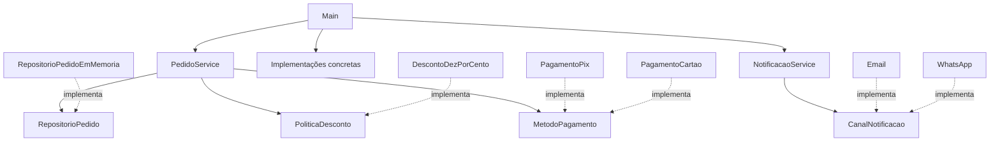

# Guia de estudo e defesa — Checkout com SOLID em Java

**Projeto:** [toledev/PadroesProjetoSOLID](https://github.com/toledev/PadroesProjetoSOLID).  
**Base do projeto:** commit `5f9f436adb42345757caff4753c0ea6ce913c38d` — `Adiciona projeto de checkout com SOLID`.  
**Preparado em:** 08/10/2026.  
**Escopo:** todos os 18 arquivos Java, o README e a configuração de exclusões do Git. As explicações descrevem a versão local atualizada em 08/10/2026, com pagamento injetado pelo construtor. Os exercícios adicionais da seção 10 continuam sendo propostas de estudo, não funcionalidades já implementadas.

**Revisão orientada pelo enunciado:** este guia foi revisado após a leitura das três páginas de [Trabalho — Princípios do SOLID com Java](</C:/Users/ryanf/Downloads/Trabalho - Princípios do SOLID com Java.pdf>). A prioridade é defender o que foi exigido e realizar o teste de extensão. Questões de produção aparecem como aprofundamento, não como requisitos adicionais inventados.

**Adequação aplicada:** `MetodoPagamento` agora é recebido pelo **construtor**, como exige o PDF. O Main monta um serviço com Pix e outro com cartão. Foram alterados apenas dois arquivos Java para isso; não foram adicionados frameworks, interfaces ou classes. Este guia e o README refletem a versão local atualizada. Alterações locais não significam publicação no GitHub nem submissão na plataforma.

## Índice

0. [O enunciado e a revisão de conformidade](#0-o-enunciado-e-a-revisão-de-conformidade)
1. [Revisão de emergência e fala de abertura](#1-revisão-de-emergência-e-fala-de-abertura)
2. [Visão geral e organização](#2-visão-geral-e-organização)
3. [Execução passo a passo](#3-execução-passo-a-passo)
4. [Domínio: cada classe e método](#4-domínio-cada-classe-e-método)
5. [Contratos: as quatro interfaces](#5-contratos-as-quatro-interfaces)
6. [Infraestrutura: cada implementação](#6-infraestrutura-cada-implementação)
7. [Serviços e Main](#7-serviços-e-main)
8. [SOLID aplicado e seus limites](#8-solid-aplicado-e-seus-limites)
9. [Java e orientação a objetos na defesa](#9-java-e-orientação-a-objetos-na-defesa)
10. [Alterações práticas que o professor pode pedir](#10-alterações-práticas-que-o-professor-pode-pedir)
11. [Limitações, falhas e evolução](#11-limitações-falhas-e-evolução)
12. [Banco de perguntas com respostas](#12-banco-de-perguntas-com-respostas)
13. [Como executar e testar](#13-como-executar-e-testar)
14. [Roteiro de simulado e checklist final](#14-roteiro-de-simulado-e-checklist-final)
15. [Referências](#15-referências)

## 0. O enunciado e a revisão de conformidade

### 0.1 O que foi efetivamente pedido

O trabalho exige uma aplicação orientada a objetos em **Java puro**, em um domínio de negócio real, com demonstração dos cinco princípios. Checkout é inclusive um dos exemplos sugeridos. Não exige gateway real, banco de dados, interface gráfica, API HTTP, framework ou suíte de testes.

Na defesa, o PDF prevê três atividades: **demonstração prática**, **arguição sobre os cinco princípios no código entregue** e possível **adição de nova regra ou variação de comportamento**. Portanto, a prioridade é saber executar, apontar evidências no código e criar uma implementação nova mantendo o serviço estável.

### 0.2 Matriz: requisito, evidência e avaliação

| Exigência do PDF | Evidência no projeto | Avaliação para a defesa |
|---|---|---|
| Java puro e domínio real — p. 1 | Java padrão; checkout de e-commerce | Atendido no código observado. |
| Pelo menos 4 classes de domínio/entidade — p. 1 | `Cliente`, `Produto`, `ItemPedido`, `Pedido`; adicionalmente `ReciboPagamento` | Atendido mesmo sem contar o recibo como entidade. Há 5 classes no pacote de domínio. |
| Pelo menos 3 interfaces/classes abstratas — p. 1 | 4 interfaces em `contratos` | Atendido. Não precisa adicionar classe abstrata. |
| Pelo menos 2 classes de serviço — p. 1 | `PedidoService` e `NotificacaoService` | Atendido. Duas instâncias de uma mesma classe não seriam duas classes, mas aqui são classes distintas. |
| Entidades só com atributos, integridade e invariantes — p. 1 | Domínio sem cobrança, persistência ou envio; validações nos construtores | Alinhado; esteja pronto para justificar os cálculos derivados em item/pedido e os limites da transição para pago. |
| Extender por novas implementações sem alterar serviço central — pp. 1–2 | Interfaces de pagamento, desconto e canal | Atendido para extensões compatíveis com esses contratos. |
| Não desviar regra por inspeção de tipos/`instanceof` — p. 2 | Não há `instanceof` ou seleção por tipo nos serviços | Atendido no código original. |
| Implementações cumprem contratos; sem métodos vazios para ignorá-los — p. 2 | Métodos concretos realizam cálculo, criam recibo, adicionam à lista ou imprimem | Há evidência no escopo simulado; formalização dos contratos e testes reforçariam a defesa de LSP. |
| Interfaces coesas com 1 a 3 métodos — p. 2 | Cada uma das 4 interfaces possui 1 método | Atendido, inclusive no limite numérico específico do trabalho. |
| Dependências de serviço abstratas, recebidas pelo construtor — p. 2 | Repositório, desconto e pagamento entram no construtor de PedidoService; canal entra no de NotificacaoService | Atendido na versão local atualizada. |
| Sem `new` de repositórios/gateways/notificações concretas no serviço — p. 2 | Os dois serviços não instanciam esses detalhes | Atendido. |
| Main monta grafo e executa pelo menos dois cenários — p. 2 | Pix + WhatsApp; cartão + e-mail | Atendido. São os mesmos tipos de cenário exemplificados no PDF. |
| Fontes em `src/main/java` — p. 3 | Estrutura presente | Atendido. |
| `.gitignore` ignora `target/`, `build/`, `.idea/`, `.class`, `.iml` — p. 3 | Arquivo contém exatamente esses cinco padrões | Atendido. `*.class` também cobre os compilados gerados em `out`. |
| Repositório GitHub e submissão na plataforma — p. 3 | Repositório clonado do endereço fornecido | Repositório verificado; envio na plataforma não foi verificado. |
| Commits até 19h do dia da avaliação — p. 3 | Regra de entrega do enunciado | O PDF não informa fuso nem data de calendário. Como você informou que a prova é hoje, confira o prazo da instituição; não confunda este guia local com envio/commit. |

Esta matriz é uma análise técnica, não uma garantia de nota. A interpretação e avaliação final pertencem ao professor.

### 0.3 Ajuste aplicado: pagamento pelo construtor

O código atual usa `new PedidoService(repositorio, desconto, pagamento)` e depois `processar(pedido)`.

Na versão inicial, o pagamento era passado a `processar`. Isso é injeção por método, válida em geral, mas o enunciado pede construtor. A mudança foi pequena: adicionar o campo `pagamento`, recebê-lo no construtor e retirar esse parâmetro de `processar`. O fluxo de cálculo, pagamento e salvamento continua igual.

**Explicação mais simples para o professor:**

> O serviço recebe três ferramentas prontas no construtor: onde salvar, qual desconto aplicar e como pagar. Ele conhece apenas as interfaces. O Main monta um serviço com Pix e outro com cartão. Depois, cada serviço recebe somente o pedido para processar. Para adicionar outro pagamento, crio a implementação e a passo no construtor, sem alterar a lógica do serviço.

#### Código atual de `servicos/PedidoService.java`

```java
package com.faculdade.solid.servicos;

import com.faculdade.solid.contratos.MetodoPagamento;
import com.faculdade.solid.contratos.PoliticaDesconto;
import com.faculdade.solid.contratos.RepositorioPedido;
import com.faculdade.solid.dominio.Pedido;
import com.faculdade.solid.dominio.ReciboPagamento;

public class PedidoService {
    private final RepositorioPedido repositorio;
    private final PoliticaDesconto politicaDesconto;
    private final MetodoPagamento pagamento;

    public PedidoService(RepositorioPedido repositorio, PoliticaDesconto politicaDesconto,
                         MetodoPagamento pagamento) {
        this.repositorio = repositorio;
        this.politicaDesconto = politicaDesconto;
        this.pagamento = pagamento;
    }

    public ReciboPagamento processar(Pedido pedido) {
        ReciboPagamento recibo = pagamento.pagar(politicaDesconto.aplicar(pedido.getTotal()));
        pedido.marcarComoPago();
        repositorio.salvar(pedido);
        return recibo;
    }
}
```

#### Código atual de `Main.java`

```java
package com.faculdade.solid;

import com.faculdade.solid.contratos.RepositorioPedido;
import com.faculdade.solid.dominio.Cliente;
import com.faculdade.solid.dominio.ItemPedido;
import com.faculdade.solid.dominio.Pedido;
import com.faculdade.solid.dominio.Produto;
import com.faculdade.solid.dominio.ReciboPagamento;
import com.faculdade.solid.infra.DescontoDezPorCento;
import com.faculdade.solid.infra.Email;
import com.faculdade.solid.infra.PagamentoCartao;
import com.faculdade.solid.infra.PagamentoPix;
import com.faculdade.solid.infra.RepositorioPedidoEmMemoria;
import com.faculdade.solid.infra.WhatsApp;
import com.faculdade.solid.servicos.NotificacaoService;
import com.faculdade.solid.servicos.PedidoService;
import java.math.BigDecimal;
import java.util.List;

public class Main {
    public static void main(String[] args) {
        RepositorioPedido repositorio = new RepositorioPedidoEmMemoria();
        PedidoService pedidoServicePix = new PedidoService(
                repositorio, new DescontoDezPorCento(), new PagamentoPix());
        PedidoService pedidoServiceCartao = new PedidoService(
                repositorio, new DescontoDezPorCento(), new PagamentoCartao());

        Produto teclado = new Produto("Teclado", new BigDecimal("100.00"));
        Produto mouse = new Produto("Mouse", new BigDecimal("50.00"));

        Pedido pedidoPix = new Pedido("PED-001", new Cliente("Ana", "11999990000"),
                List.of(new ItemPedido(teclado, 1)));
        ReciboPagamento reciboPix = pedidoServicePix.processar(pedidoPix);
        new NotificacaoService(new WhatsApp()).avisarPagamentoConfirmado(pedidoPix, reciboPix);

        Pedido pedidoCartao = new Pedido("PED-002", new Cliente("Bruno", "bruno@email.com"),
                List.of(new ItemPedido(mouse, 2)));
        ReciboPagamento reciboCartao = pedidoServiceCartao.processar(pedidoCartao);
        new NotificacaoService(new Email()).avisarPagamentoConfirmado(pedidoCartao, reciboCartao);
    }
}
```

As duas instâncias compartilham o repositório. Cada uma recebe sua própria instância da mesma política de 10% e um meio de pagamento diferente. Duas instâncias de PedidoService não significam duas classes: as duas classes de serviço exigidas continuam sendo PedidoService e NotificacaoService.

Não foi acrescentado tratamento de produção, classe abstrata ou validação extra a esse ajuste. Os colaboradores são montados corretamente pelo Main, mantendo a explicação curta.

**Por que alterar o serviço aqui não contradiz OCP?** A alteração adequou a composição ao requisito do trabalho. Depois dela, acrescentar uma implementação de pagamento continua sem exigir alteração no fluxo central.

### 0.4 Outras questões de interpretação que merecem preparo

**“Exclusivamente interfaces/abstrações” obriga interface para Pedido?** A leitura arquitetural usual é que os colaboradores do serviço — repositório, política, meio e canal — sejam abstrações. `Pedido` e `ReciboPagamento` são dados de domínio usados no caso de uso. Não há exigência expressa de interface por entidade. Se o professor interpretar de outro modo, peça o alcance do requisito; não afirme que essa frase obriga criar abstrações sem necessidade.

**SRP: `getTotal` e `getSubtotal` podem estar nas entidades?** São cálculos derivados dos próprios atributos e preservam a coerência do estado, sem I/O ou seleção de estratégias. Essa é a justificativa para mantê-los. O PDF usa uma formulação restrita (“atributos, regras de integridade interna e invariantes de estado”), então prepare-se para explicar essa leitura. Se o professor pedir todas as regras de cálculo em políticas, uma alternativa é `CalculadoraTotal` abstrata injetada no serviço, com acesso de leitura controlado aos itens. Isso é uma adaptação possível à interpretação dele, não uma violação inequívoca já demonstrada.

**Simulação é descumprimento?** O PDF não exige integrações reais nem persistência durável. Portanto, diga claramente que são implementações simuladas de capacidades de negócio. Uma classe que imprime a mensagem realiza o comportamento didático de saída; uma classe com método vazio para ignorar o contrato seria outro caso e é explicitamente proibida.

**LSP:** as implementações atuais não têm métodos vazios ou exceções de “não implementado”, mas ainda é preciso explicar o contrato. Para `pagar`, explicite que o modelo demonstrado é síncrono e retorna recibo de aprovação. Falhas operacionais e pagamentos pendentes não foram modelados.

### 0.5 O que priorizar e o que deixar para aprofundamento

| Prioridade | Assunto |
|---|---|
| Máxima | Injeção pelo construtor e montagem de dois serviços; quantidades de classes/interfaces/serviços; execução dos dois cenários. |
| Máxima | Apontar cada princípio em arquivos concretos e demonstrar extensão sem editar o serviço. |
| Alta | Contrato comportamental, responsabilidades das entidades, polimorfismo, `BigDecimal`, lista protegida e fluxo. |
| Complementar | Cobrança repetida, falhas, pendência, persistência do recibo, contatos. Úteis para arguição, não requisitos expressos. |
| Avançada | Outbox, reconciliação distribuída, provedores externos e concorrência. Leia depois de dominar o núcleo. |

## 1. Revisão de emergência e fala de abertura

### Se você tiver só 15 minutos

1. **3 minutos:** leia a matriz da seção 0 e entenda a injeção pelo construtor; entenda `processar`: total → desconto → pagar → marcar → salvar → recibo.
2. **3 minutos:** memorize um exemplo concreto de cada letra de SOLID, na seção 8.
3. **4 minutos:** pratique adicionar um pagamento e uma política de desconto, na seção 10.
4. **3 minutos:** pratique o roteiro de extensão da seção 10.0 e explique o contrato de Liskov; deixe os temas avançados da seção 11 para depois.
5. **2 minutos:** diga a fala abaixo em voz alta e explique por que não existe `if` para escolher Pix ou cartão no serviço.

### Fala de abertura de aproximadamente um minuto

> Meu projeto é um checkout de e-commerce em Java puro, um dos domínios sugeridos no trabalho. Ele tem cinco classes de domínio, quatro interfaces e duas classes de serviço, atendendo aos mínimos de modelagem. O Main demonstra Pix com WhatsApp e cartão com e-mail. O PedidoService coordena cálculo, desconto, pagamento e salvamento por contratos; o NotificacaoService prepara e envia a confirmação por um canal abstrato. Novos meios, descontos e canais podem ser implementados sem alterar o fluxo central. Os pagamentos e envios são simulados, pois o foco do trabalho é a estrutura e os cinco princípios.

**Ao apresentar:** os três colaboradores de PedidoService chegam pelo construtor. `processar` recebe apenas o pedido. O código local já contém essa alteração; confira se está apresentando essa versão e não uma cópia antiga do GitHub.

### O mapa mental essencial

| Pergunta | Resposta curta |
|---|---|
| Quem conhece os preços? | `Produto`. |
| Quem calcula preço × quantidade? | `ItemPedido.getSubtotal()`. |
| Quem soma os subtotais? | `Pedido.getTotal()`. |
| Quem decide o desconto? | A implementação de `PoliticaDesconto`. |
| Quem coordena o checkout? | `PedidoService`. |
| Quem decide Pix ou cartão? | O `Main`, ao passar a implementação ao construtor de `PedidoService`. |
| Quem monta a mensagem? | `NotificacaoService`. |
| Quem envia a mensagem? | A implementação de `CanalNotificacao`; atualmente só imprime. |
| Quem escolhe as dependências concretas? | `Main`. |
| Quanto cada cenário paga? | R$ 90,00: ambos têm R$ 100,00 de total bruto e 10% de desconto. |
| Onde fica o valor líquido? | No `ReciboPagamento`; o pedido não armazena esse valor. |

## 2. Visão geral e organização

### O que o sistema realmente faz

É um programa de console. Não há interface gráfica, servidor HTTP, API REST, banco de dados, autenticação ou integração real de pagamento. O “cadastro” mencionado no README é a construção de objetos no `Main`, e não um CRUD acessível ao usuário.

```text
src/main/java/com/faculdade/solid/
├── Main.java
├── contratos/
│   ├── CanalNotificacao.java
│   ├── MetodoPagamento.java
│   ├── PoliticaDesconto.java
│   └── RepositorioPedido.java
├── dominio/
│   ├── Cliente.java
│   ├── Produto.java
│   ├── ItemPedido.java
│   ├── Pedido.java
│   └── ReciboPagamento.java
├── infra/
│   ├── DescontoDezPorCento.java
│   ├── Email.java
│   ├── WhatsApp.java
│   ├── PagamentoPix.java
│   ├── PagamentoCartao.java
│   └── RepositorioPedidoEmMemoria.java
└── servicos/
    ├── PedidoService.java
    └── NotificacaoService.java
```

| Parte | Papel | Motivo da separação |
|---|---|---|
| `dominio` | Dados e regras locais de negócio | Preço positivo e pedido com itens não dependem de tecnologia de pagamento. |
| `contratos` | Operações de que os consumidores precisam | Permitem que serviços trabalhem sem escolher fornecedores concretos. |
| `infra` | Implementações substituíveis | Concentra detalhes dos mecanismos usados na demonstração. |
| `servicos` | Coordenação dos casos de uso | Separa o fluxo de checkout dos detalhes de envio e armazenamento. |
| `Main` | Construção e execução dos cenários | Centraliza a escolha das implementações. |

**Nuance para a defesa:** `DescontoDezPorCento` está em `infra`, mas desconto é uma política de negócio. Em um projeto maior, seria razoável colocá-la em `dominio.politicas` ou `politicas`. O nome do pacote não torna uma solução SOLID; o que importa é a distribuição das responsabilidades e dependências.

### Dependências principais



As setas do serviço para interfaces representam dependências de código. Em execução, a chamada chega ao objeto concreto escolhido no `Main`. O serviço ainda depende de classes concretas do domínio, como `Pedido`; DIP não exige criar interface para todos os objetos.

## 3. Execução passo a passo

### Preparação compartilhada

O `Main` cria um único `RepositorioPedidoEmMemoria` e duas instâncias de `PedidoService`: `pedidoServicePix` e `pedidoServiceCartao`. Cada serviço recebe uma instância de `DescontoDezPorCento` e seu pagamento. Os dois compartilham o repositório, que ao final mantém duas referências de pedidos em sua lista.

Também cria dois produtos: teclado de `100.00` e mouse de `50.00`.

### Cenário 1 — Ana, teclado, Pix e WhatsApp

1. Cria `Cliente("Ana", "11999990000")`.
2. Cria `ItemPedido(teclado, 1)`.
3. Cria `Pedido("PED-001", cliente, listaDeItens)`; `pago` começa como `false`.
4. Chama `pedidoServicePix.processar(pedidoPix)`; esse serviço já recebeu `PagamentoPix` no construtor.
5. `pedido.getTotal()` calcula `100.00 × 1 = 100.00`.
6. `politicaDesconto.aplicar(...)` calcula `100.00 × 0.90 = 90.00`, com duas casas.
7. `PagamentoPix.pagar(90.00)` cria o recibo com a descrição de aprovação.
8. `pedido.marcarComoPago()` muda `pago` para `true`.
9. `repositorio.salvar(pedido)` adiciona o pedido à lista e imprime a confirmação de salvamento.
10. `processar` devolve o recibo ao `Main`.
11. O `Main` cria `NotificacaoService(new WhatsApp())` e pede o aviso.
12. O serviço monta a mensagem; `WhatsApp.enviar` a imprime.

### Cenário 2 — Bruno, dois mouses, cartão e e-mail

Repete o fluxo com `PED-002`, contato `bruno@email.com`, o serviço `pedidoServiceCartao` já configurado com `PagamentoCartao` e o canal `Email`. A quantidade é 2, então `50.00 × 2 = 100.00`. O pagamento também é de `90.00`.

### Estado versus valor

| Momento | `pedido.isPago()` | `pedido.getTotal()` | Valor do recibo |
|---|---:|---:|---:|
| Antes de processar | `false` | `100.00` | Não existe ainda |
| Depois de processar | `true` | `100.00` | `90.00` |

**Pegadinha:** o desconto não altera o preço dos produtos nem o total bruto retornado pelo pedido. Ele gera o valor enviado ao pagamento, que aparece no recibo.

### Saída dos dois cenários

```text
Pedido PED-001 salvo.
WhatsApp para 11999990000: Pedido PED-001 confirmado. Pagamento aprovado via Pix. Total pago: R$ 90.00
Pedido PED-002 salvo.
E-mail para bruno@email.com: Pedido PED-002 confirmado. Pagamento aprovado via cartao. Total pago: R$ 90.00
```

A saída usa ponto decimal porque concatena o `BigDecimal` diretamente. Não há formatação monetária brasileira. A aprovação não é impressa pelo pagamento; ela é incluída na mensagem pelo serviço de notificação.

## 4. Domínio: cada classe e método

Todos os caminhos desta seção partem de `src/main/java/com/faculdade/solid/`.

### 4.1 `dominio/Cliente.java`

**Responsabilidade:** representar nome e contato de um cliente válido para o escopo mínimo da aplicação.

| Trecho | O que faz | Por que foi usado |
|---|---|---|
| `private final String nome` | Guarda o nome sem acesso direto externo e sem reatribuição após a construção | Encapsulamento e estabilidade dos dados. |
| `private final String contato` | Guarda um contato genérico | Permite usar o mesmo objeto com telefone ou e-mail na demonstração. |
| Construtor | Rejeita nome/contato nulos ou em branco | Evita criar objetos que já nasçam sem dados essenciais. |
| `getNome()` | Devolve o nome | Expõe leitura sem um setter. Não é usado no fluxo atual. |
| `getContato()` | Devolve o destino | É utilizado em `NotificacaoService`. |

O teste `nome == null || nome.isBlank()` usa curto-circuito: se for nulo, a segunda parte não executa. Isso evita chamar método sobre `null`. `isBlank()` também rejeita texto composto apenas por espaços.

**SOLID:** SRP, porque dados e validações do cliente ficam juntos. Isso não exige que cada validação tenha sua própria classe.

**Limite:** não valida formato de telefone ou e-mail, não remove espaços e não permite vários contatos. Uma string não vazia pode ser inadequada para o canal escolhido.

**Resposta de defesa:** “Usei um contato genérico para simplificar os dois cenários. Se houvesse múltiplos canais para o mesmo cliente, modelaria destinos por canal ou tipos como Email e Telefone.”

### 4.2 `dominio/Produto.java`

**Responsabilidade:** representar nome e preço de um produto.

O construtor exige nome preenchido e preço estritamente positivo. `preco.signum()` devolve `-1`, `0` ou `1`, conforme o sinal; `<= 0` rejeita zero e negativos. `getNome()` e `getPreco()` expõem os valores. O nome não participa dos cálculos atuais.

**Por que validar aqui?** Todo ponto que criar um `Produto` deve obedecer à mesma regra. Se a validação existisse apenas no `Main`, outro chamador poderia criar um produto inválido.

**Por que `BigDecimal`?** Para representar valores decimais e controlar arredondamento. Os exemplos usam strings como `"100.00"`, evitando partir de uma aproximação binária de `double`. Consulte a [documentação de BigDecimal](https://docs.oracle.com/en/java/javase/11/docs/api/java.base/java/math/BigDecimal.html).

**SOLID:** SRP: a classe cuida dos dados e invariantes do produto; não cobra, salva nem envia mensagens.

**Possível pergunta:** “Um produto gratuito poderia existir?” Atualmente não. Permitir zero exigiria alterar a validação para `< 0` e discutir se checkout e pagamento aceitam valor zero. Isso é mudança de regra de negócio, não falha automática de SOLID.

**Limite:** o preço pode ter mais de duas casas decimais. O código só arredonda depois de aplicar o desconto.

### 4.3 `dominio/ItemPedido.java`

**Responsabilidade:** relacionar um produto à quantidade comprada e calcular seu subtotal.

O construtor exige produto não nulo e quantidade maior que zero. Guarda ambos em campos `private final`. Não existem getters de produto e quantidade no código atual; a operação exposta é `getSubtotal()`.

```java
return produto.getPreco().multiply(BigDecimal.valueOf(quantidade));
```

Essa expressão lê o preço, converte a quantidade inteira para `BigDecimal` e multiplica. Exemplos: teclado × 1 = 100; mouse × 2 = 100.

**Por que quantidade não fica em `Produto`?** Porque ela pertence à compra. O mesmo produto pode aparecer com quantidades diferentes em pedidos diferentes.

**Por que subtotal fica no item?** O item reúne as informações necessárias para essa regra. Isso mantém a responsabilidade próxima dos dados e evita duplicar a multiplicação nos serviços.

**SOLID:** SRP e coesão. `ItemPedido` não escolhe desconto nem pagamento.

**Se o professor pedir alteração:** para vender produtos por peso, `int quantidade` seria insuficiente. Seria necessário modelar quantidade decimal e unidade de medida, além de rever validações e arredondamento.

### 4.4 `dominio/Pedido.java`

**Responsabilidade:** representar um pedido com código, cliente, itens e estado de pagamento.

| Campo ou método | Explicação |
|---|---|
| `codigo` | Identificação textual. Não há garantia global de unicidade. |
| `cliente` | Cliente associado. A referência não muda após a construção. |
| `itens` | Lista de itens protegida na construção. |
| `pago` | Estado mutável; um campo booleano de instância começa em `false`. |
| Construtor | Exige código preenchido, cliente, lista não nula e pelo menos um item. |
| `getTotal()` | Recalcula a soma dos subtotais toda vez que é chamado. |
| `marcarComoPago()` | Atribui `true`; não verifica recibo, pagamento anterior ou autorização. |
| `getCodigo()` / `getCliente()` | Permitem leitura dos dados usados pelos serviços. |
| `isPago()` | Permite consultar o estado; o fluxo original não usa essa consulta. |

#### Por que `List.copyOf(itens)`?

Cria uma lista não modificável com os elementos recebidos. Mudar uma lista mutável original depois não altera a estrutura armazenada no pedido. Não faz cópia profunda dos itens e rejeita elementos nulos com `NullPointerException`. Pode reutilizar uma lista já adequada; não significa necessariamente uma nova alocação. Consulte [List.copyOf](https://docs.oracle.com/en/java/javase/11/docs/api/java.base/java/util/List.html#copyOf(java.util.Collection)).

**Pergunta provável:** “Mas no Main já tem List.of; por que copiar?” Porque o construtor precisa proteger sua regra para qualquer chamador, não apenas para o `Main` atual.

#### A linha de streams, desmontada

```java
return itens.stream()
        .map(ItemPedido::getSubtotal)
        .reduce(BigDecimal.ZERO, BigDecimal::add);
```

1. `stream()` inicia uma sequência de processamento dos itens.
2. `map(...)` transforma cada item em seu subtotal.
3. `ItemPedido::getSubtotal` corresponde à ideia de `item -> item.getSubtotal()`.
4. `reduce(...)` acumula os valores.
5. `BigDecimal.ZERO` é o valor inicial e elemento neutro da soma.
6. `BigDecimal::add` representa a soma do acumulado com o próximo subtotal.

Não há paralelismo aqui: `stream()` cria um fluxo sequencial. O cálculo percorre todos os itens, com custo linear no número de itens, considerando o custo aritmético separadamente.

**SOLID:** SRP: manter invariantes e calcular o total bruto são responsabilidades coesas de um pedido. Desconto variável, cobrança e persistência são delegados.

**Limites:** o pedido é mutável por causa de `pago`; não guarda recibo, valor final, data ou histórico; permite ser marcado como pago diretamente. As classes de domínio não são `final`, portanto também não se deve prometer imutabilidade estrita de qualquer subclasse possível.

### 4.5 `dominio/ReciboPagamento.java`

**Responsabilidade:** carregar descrição e valor retornados pelo pagamento.

Tem dois campos `private final`, um construtor que atribui os argumentos e dois getters: `getDescricao()` e `getValor()`. Não realiza cálculo ou validação.

**Por que retornar um recibo em vez de booleano?** Um booleano informa apenas sucesso/falha. O recibo oferece dados para a confirmação, embora ainda seja uma representação simplificada.

**SOLID:** SRP: representar o resultado do pagamento, separado de executar a cobrança ou montar a mensagem.

**Limite crítico:** o construtor aceita descrição ou valor nulos e valores negativos. O recibo não possui status, identificador de transação nem vínculo com um pedido. O código interpreta a volta normal de `pagar` como aprovação, sem conferir o conteúdo.

**Defesa honesta:** “É um objeto de resultado simplificado. Eu fortaleceria suas invariantes e o contrato de pagamento antes de integrar um provedor real.”

## 5. Contratos: as quatro interfaces

Uma interface define operações disponíveis ao consumidor. Aqui os métodos são implicitamente `public abstract`. A implementação concreta fornece o corpo com `implements`.

| Interface | Método | Consumidor | Implementações atuais |
|---|---|---|---|
| `MetodoPagamento` | `ReciboPagamento pagar(BigDecimal valor)` | `PedidoService` | `PagamentoPix`, `PagamentoCartao` |
| `PoliticaDesconto` | `BigDecimal aplicar(BigDecimal valorOriginal)` | `PedidoService` | `DescontoDezPorCento` |
| `RepositorioPedido` | `void salvar(Pedido pedido)` | `PedidoService` | `RepositorioPedidoEmMemoria` |
| `CanalNotificacao` | `void enviar(String destino, String mensagem)` | `NotificacaoService` | `Email`, `WhatsApp` |

### 5.1 `MetodoPagamento`

Permite pedir uma cobrança sem conhecer o meio concreto. O tipo de retorno permite ao serviço receber um recibo em todos os meios atuais.

**Contrato implícito esperado pelo consumidor:** quando `pagar` retorna normalmente, deve haver um recibo coerente de um pagamento aprovado. Se uma implementação retornar `null`, o serviço ainda marca o pedido como pago e salva; a notificação falhará depois. A assinatura sozinha não previne isso.

Para uma evolução, documente entradas aceitas, significado do sucesso, valor efetivamente cobrado e como recusas/pendências são representadas. Exceções de falha previstas no contrato não são, por si só, violação de LSP.

### 5.2 `PoliticaDesconto`

Recebe o valor bruto e devolve **o valor final após o desconto**, não o valor do desconto. Para 100 com 10%, retorna 90, não 10. Essa distinção é essencial para implementar novas políticas corretamente.

Um contrato mais explícito definiria nulos, negativos, possibilidade de zero, limites do desconto e local do arredondamento. A implementação atual não documenta nem valida tudo isso.

### 5.3 `RepositorioPedido`

Expõe apenas o que o checkout precisa: salvar um pedido. O serviço não precisa saber se isso significa lista, arquivo ou banco.

Não há métodos de consulta, remoção ou atualização explícita. O nome `salvar` não esclarece se o comportamento é inserir, atualizar ou fazer ambos; a implementação atual sempre adiciona à lista.

Se surgir um caso de consulta, é possível criar uma interface específica de consulta. ISP não exige que todas as interfaces tenham um único método; exige que consumidores não dependam de operações desnecessárias.

### 5.4 `CanalNotificacao`

Separa o conteúdo da mensagem de seu transporte. O serviço informa destino e texto; a implementação decide como enviar.

**Limite:** `String destino` é genérico. E-mail e telefone reais têm formatos diferentes. Para manter substituibilidade, a aplicação precisa fornecer um destino adequado ou evoluir a abstração. A versão atual apenas imprime e, por isso, não encontra essa incompatibilidade no envio.

**Conexão comum com SOLID:** as interfaces pequenas apoiam ISP; permitem DIP nos serviços e extensão via OCP. LSP depende de cumprir o comportamento esperado, não apenas de implementar essas assinaturas.

## 6. Infraestrutura: cada implementação

### 6.1 `infra/DescontoDezPorCento.java`

Implementa `PoliticaDesconto` com:

```java
return valorOriginal.multiply(new BigDecimal("0.90"))
        .setScale(2, RoundingMode.HALF_UP);
```

Multiplicar por `0.90` mantém 90% e retira 10%. A etapa final fixa duas casas usando arredondamento em que um empate é afastado de zero. Exemplo positivo: `10.05 × 0.90 = 9.045`, que vira `9.05`.

**Por que não multiplicar por `0.10`?** Isso produziria o valor descontado, e o serviço passaria esse valor errado ao pagamento.

**SOLID:** SRP para a regra de desconto; OCP e DIP porque o serviço consome `PoliticaDesconto`.

**Limites:** não verifica nulo ou negativo; desconto aplicado ao total pode arredondar de modo diferente de desconto item a item; valores muito pequenos podem virar zero. A posição do arredondamento é uma decisão de negócio, não mera escolha de sintaxe.

### 6.2 `infra/PagamentoPix.java`

Implementa `MetodoPagamento`. `pagar(valor)` cria `ReciboPagamento("Pagamento aprovado via Pix", valor)`.

Não gera QR Code, não consulta banco e não aguarda confirmação externa. Não imprime nada. É uma simulação de aprovação síncrona.

**SOLID:** encapsula um meio de pagamento e pode ser trocado pelo contrato. A simplificação mantém o foco didático.

### 6.3 `infra/PagamentoCartao.java`

Tem a mesma estrutura de Pix, mudando a descrição para `"Pagamento aprovado via cartao"`. Não recebe número de cartão, não parcela e não consulta uma adquirente.

**Por que duas classes se o código é quase igual?** Elas representam um ponto real de variação. Em integrações reais, cada uma teria detalhes próprios. Para esta demonstração, a separação torna o polimorfismo visível; em um programa sem perspectiva de variação, interfaces e classes extras teriam um custo que precisaria ser justificado.

### 6.4 `infra/Email.java`

`enviar(destino, mensagem)` imprime `E-mail para <destino>: <mensagem>`. A implementação recebe o texto pronto: não escolhe qual pedido confirmar nem calcula o valor.

### 6.5 `infra/WhatsApp.java`

Faz o mesmo com o prefixo `WhatsApp para`. Não usa a API do WhatsApp.

**SOLID de ambos:** SRP separa a mensagem do mecanismo de envio; OCP permite novos canais; DIP mantém o serviço independente do canal concreto. A intercambialidade do exemplo não demonstra integração real nem validação de destinatários.

### 6.6 `infra/RepositorioPedidoEmMemoria.java`

```java
private final List<Pedido> pedidos = new ArrayList<>();
```

Declara o campo pelo tipo `List` e o inicializa com `ArrayList`. `final` impede trocar a referência do campo, mas não impede `pedidos.add(...)`.

O método `salvar` adiciona o pedido e imprime `Pedido <codigo> salvo.`. Os dados existem apenas enquanto a instância estiver viva no processo. Fechar o programa perde o armazenamento.

**Detalhes que podem cair:**

- Guarda a referência do pedido, sem clonar o objeto.
- Aceita duplicatas; salvar duas vezes adiciona duas entradas.
- Não garante unicidade de código.
- Não expõe consulta para verificar a lista externamente.
- Não fornece controle de concorrência.
- Se receber `null`, adiciona `null` à lista antes de falhar ao ler o código na impressão.
- A impressão é uma conveniência didática; em uma arquitetura maior, logging poderia ser tratado separadamente.

**SOLID:** implementa a abstração de persistência consumida pelo serviço. Trocar a tecnologia não deveria mudar a coordenação do checkout se o contrato permanecer compatível.

## 7. Serviços e Main

### 7.1 `servicos/PedidoService.java`

É o núcleo do caso de uso. Tem três dependências fixas por instância:

```java
private final RepositorioPedido repositorio;
private final PoliticaDesconto politicaDesconto;
private final MetodoPagamento pagamento;
```

O construtor recebe repositório, política de desconto e pagamento prontos, todos pelos tipos de suas interfaces. Isso é **injeção por construtor**, conforme o PDF. O serviço não cria essas implementações internamente.

O método `processar(Pedido pedido)` recebe somente o dado a processar. O pagamento já está no campo `pagamento`, definido quando o serviço foi construído. Cada instância usa seu meio configurado; o método não precisa descobrir se é Pix ou cartão.

#### Corpo atual e significado de cada instrução

```java
ReciboPagamento recibo = pagamento.pagar(
        politicaDesconto.aplicar(pedido.getTotal()));
pedido.marcarComoPago();
repositorio.salvar(pedido);
return recibo;
```

| Instrução | Papel | Premissa |
|---|---|---|
| `pedido.getTotal()` | Obtém o bruto | Pedido e itens válidos. |
| `politicaDesconto.aplicar(...)` | Obtém o líquido | Política retorna um valor adequado ao pagamento. |
| `pagamento.pagar(...)` | Executa a estratégia de pagamento | Retorno normal significa aprovação. |
| `marcarComoPago()` | Atualiza estado | A cobrança foi concluída com sucesso. |
| `repositorio.salvar(...)` | Persiste o pedido | O mecanismo de armazenamento funciona. |
| `return recibo` | Entrega o resultado ao chamador | O recibo está disponível e coerente. |

**Por que isso não viola SRP por fazer várias chamadas?** A responsabilidade é coordenar o caso de uso “processar pedido”. Vários passos podem pertencer à mesma responsabilidade. O serviço delega algoritmos e detalhes técnicos em vez de implementá-los.

**Limite:** não valida argumentos/dependências, não bloqueia reprocessamento, não valida recibo, não trata inconsistência entre cobrança e salvamento. A execução é sequencial e não há transação.

### 7.2 `servicos/NotificacaoService.java`

Recebe `CanalNotificacao` no construtor e guarda em um campo `final`. `avisarPagamentoConfirmado` pega o contato do cliente, código do pedido, descrição e valor do recibo, monta o texto e chama `canal.enviar`.

**Por que separar de `PedidoService`?** Alterar texto ou canal de notificação não deveria exigir alterar a coordenação de cobrança e persistência. A separação também permite testar o texto com um canal falso.

**Por que o próprio canal não monta a mensagem?** Assim, e-mail e WhatsApp podem receber o mesmo conteúdo sem duplicar a regra de confirmação. Se cada canal exigir um formato específico, pode haver formatação por canal sem devolver responsabilidade financeira ao transporte.

**Limites:** não verifica `pedido.isPago()`, não confere se recibo e pedido correspondem e não trata falhas. É possível chamar o método manualmente com um pedido não pago e ele anunciar confirmação.

### 7.3 `Main.java`

`public static void main(String[] args)` é o ponto de entrada. `public` permite acesso, `static` dispensa instanciar `Main`, `void` indica que não devolve valor, e `args` recebe argumentos de execução, que não são usados.

| Linhas da versão analisada | O que fazem |
|---|---|
| 3–18 | Importam classes do projeto e da biblioteca Java. |
| 22 | Criam o repositório concreto, guardado em variável de tipo interface. |
| 23–26 | Montam dois serviços, cada um com repositório, desconto e pagamento recebidos pelo construtor. |
| 28–29 | Criam teclado e mouse com valores decimais. |
| 31–32 | Montam o pedido da Ana com uma lista de um item. |
| 33 | Processam com o serviço configurado para Pix e guardam o recibo. |
| 34 | Configuram WhatsApp e enviam a confirmação simulada. |
| 36–37 | Montam o pedido do Bruno com dois mouses. |
| 38 | Processam com o serviço configurado para cartão. |
| 39 | Configuram e-mail e enviam a confirmação simulada. |

O `Main` é o **ponto de composição**: sabe quais classes concretas existem e como conectá-las. Alterá-lo para selecionar uma nova implementação não contradiz o objetivo de manter o serviço fechado para essas alterações.

**Precisão sobre o uso de `new`:** o Main monta os colaboradores dos serviços. Isso não proíbe criar outros objetos nos lugares adequados: pagamentos criam recibos e o repositório cria um `ArrayList`. O PDF proíbe instanciar detalhes de infraestrutura dentro do serviço.

## 8. SOLID aplicado e seus limites

### 8.1 S — Single Responsibility Principle

**Definição para falar:** uma unidade deve ter uma responsabilidade coesa, associada a um motivo de mudança. Não significa um método por classe.

**Evidências:**

- `ItemPedido`: muda quando muda a regra local de subtotal.
- `DescontoDezPorCento`: muda quando muda essa regra de desconto.
- `PedidoService`: muda quando muda o fluxo de processamento.
- `NotificacaoService`: muda quando muda a lógica de confirmação.
- `Email`: muda quando muda o mecanismo de envio por e-mail.

**Contraexemplo:** colocar cálculo, SQL, cobrança Pix e envio de e-mail dentro de `Pedido`. A entidade passaria a mudar por motivos independentes.

**Resposta pronta:** “Separei políticas, transporte e persistência porque mudam por motivos diferentes. O serviço só coordena essas responsabilidades.”

### 8.2 O — Open/Closed Principle

**Definição para falar:** permitir estender comportamentos previstos sem editar continuamente a lógica estável que os consome.

**Evidência:** novo `MetodoPagamento` pode ser passado ao construtor sem mudar `PedidoService`; o mesmo vale para descontos e canais.

**Contraexemplo:** `if (tipo.equals("PIX")) ... else if (tipo.equals("CARTAO")) ...` dentro do serviço. Cada novo meio exigiria editar o fluxo central.

**Limite:** OCP não proíbe toda alteração de código e não antecipa qualquer requisito. Um pagamento assíncrono pode exigir mudar o modelo atual. O ponto de composição pode mudar para usar uma extensão.

**Resposta pronta:** “O serviço está protegido contra a inclusão de novas implementações do contrato atual. Não afirmo que ele nunca precise mudar diante de novos requisitos.”

### 8.3 L — Liskov Substitution Principle

**Definição para falar:** uma implementação deve poder substituir a abstração sem quebrar as expectativas de comportamento dos seus consumidores.

**Evidência no escopo do exemplo:** Pix e cartão recebem o mesmo tipo de valor, retornam um recibo com o valor recebido e não exigem ramificações no serviço. Email e WhatsApp aceitam os mesmos parâmetros e imprimem uma mensagem.

**O que o compilador verifica:** assinaturas e compatibilidade de tipos. **O que ele não garante:** que um recibo signifique aprovação real, que o valor seja correto e que as condições do contrato sejam respeitadas.

**Exemplos de problemas:**

- Uma implementação retorna `null`; o serviço espera um recibo utilizável.
- Um “boleto” retorna aprovação assim que emite o documento, embora o pagamento ainda não tenha ocorrido.
- Uma implementação devolve no recibo um valor diferente do contratado sem que o contrato permita isso.
- Uma implementação acrescenta uma restrição de entrada incompatível com o conjunto de entradas aceitas pela abstração.

**Nuance:** um pagamento pode ser recusado. Isso só quebra o contrato se o contrato não representar essa possibilidade de modo consistente; lançar uma falha prevista não viola LSP automaticamente.

**Resposta pronta:** “Implementar a interface é necessário para o polimorfismo, mas LSP também exige cumprir o contrato comportamental. No projeto esse contrato está pouco explícito e eu o documentaria e testaria.”

### 8.4 I — Interface Segregation Principle

**Definição para falar:** consumidores não devem ser obrigados a depender de operações de que não precisam.

**Evidência:** `CanalNotificacao` não exige pagar ou salvar, e `MetodoPagamento` não exige enviar mensagens. Há quatro contratos separados pelo uso.

**Contraexemplo:** uma `OperacoesCheckout` contendo `pagar`, `enviar`, `salvar` e `aplicarDesconto`. `PagamentoPix` seria obrigado a fornecer métodos sem sentido, talvez lançando `UnsupportedOperationException`.

**Limite geral:** interface com vários métodos não é automaticamente ruim. O critério é a necessidade dos clientes e a coesão do contrato. **Neste trabalho há também um critério explícito: 1 a 3 métodos por interface.** As quatro atuais têm um método cada.

**Resposta pronta:** “Os contratos foram separados por capacidade necessária ao consumidor, evitando implementações vazias de métodos irrelevantes.”

### 8.5 D — Dependency Inversion Principle

**Definição para falar:** políticas de alto nível não devem depender diretamente de detalhes de baixo nível; as dependências relevantes devem apontar para abstrações.

**Evidência:** `PedidoService` importa `RepositorioPedido`, `PoliticaDesconto` e `MetodoPagamento`; não importa `PagamentoPix` ou o repositório em memória. O `NotificacaoService` conhece `CanalNotificacao`.

**Contraexemplo:** o construtor do serviço executar `this.repositorio = new RepositorioPedidoEmMemoria()` e seu método criar `new PagamentoPix()`. Isso fixa detalhes dentro do caso de uso.

**DIP versus injeção de dependência:** DIP é o princípio de organização das dependências. Injeção é a técnica de receber colaboradores externamente. Receber uma classe concreta por construtor é injeção, mas ainda pode manter acoplamento ao detalhe concreto.

**Resposta pronta:** “PedidoService recebe repositório, desconto e pagamento pelas interfaces no construtor. O Main fornece as implementações. Assim, o fluxo não fica preso a Pix, cartão ou armazenamento em memória.”

### Comparação que evita confusão na prova

| Princípio | Pergunta que ele ajuda a responder |
|---|---|
| SRP | Essa classe muda por motivos independentes? |
| OCP | Posso acrescentar esta variação sem reescrever o consumidor? |
| LSP | A substituição mantém as expectativas de comportamento? |
| ISP | O consumidor depende apenas das operações necessárias? |
| DIP | A política está presa a um detalhe concreto? |

O mesmo trecho pode apoiar mais de um princípio. Não é necessário inventar cinco soluções isoladas para “uma letra em cada classe”.

## 9. Java e orientação a objetos na defesa

### Conceitos presentes

| Conceito | Onde aparece | Como explicar |
|---|---|---|
| Encapsulamento | Campos `private`, construtores e getters | O acesso ao estado passa por operações definidas pela classe. |
| Abstração | Interfaces de pagamento, desconto, envio e repositório | O consumidor conhece uma capacidade sem conhecer sua implementação. |
| Polimorfismo | Campo `MetodoPagamento`, injetado pelo construtor, recebe Pix ou cartão | A chamada é a mesma; o objeto concreto determina o método executado. |
| Composição | Pedido contém cliente/itens; serviços contêm colaboradores | Comportamentos são combinados por objetos associados. |
| Subtipagem por interface | `implements MetodoPagamento` | Pix e cartão são tipos utilizáveis onde o contrato é exigido. |
| Injeção manual | Construção no `Main` | Não depende de Spring ou outro contêiner. |

Não há hierarquia própria com `extends` no código. É mais preciso dizer que existe implementação de interfaces e subtipagem do que afirmar que Pix herda código de uma classe de pagamento.

### `private`, `final`, getters e `this`

- `private` restringe o acesso direto ao campo.
- `final` em um campo impede reatribuição depois de inicializado; não congela o objeto referenciado.
- `this.nome = nome` distingue o campo do parâmetro de mesmo nome.
- Getter permite ler um valor. Encapsulamento não se resume a gerar getters/setters; também envolve controlar invariantes.
- Ausência de setters reduz mudanças possíveis, mas `Pedido` continua mutável por `marcarComoPago`.

### `BigDecimal`: perguntas frequentes

`BigDecimal` é imutável: `add`, `multiply` e `setScale` devolvem resultados; não alteram o objeto original. `equals` considera valor e escala, então `90.0` e `90.00` podem não ser iguais por esse método; `compareTo(...) == 0` compara a equivalência numérica. Para valores positivos, `HALF_UP` leva um empate como `9.045` a `9.05` ao reduzir para duas casas. [Referência: BigDecimal](https://docs.oracle.com/en/java/javase/11/docs/api/java.base/java/math/BigDecimal.html).

### Interfaces funcionais e `@Override`

As quatro interfaces atuais têm um único método abstrato, portanto podem ser usadas como interfaces funcionais com lambdas, mesmo sem `@FunctionalInterface`. Essa anotação seria útil para o compilador proteger a intenção de manter um único método abstrato.

As implementações não usam `@Override`. Isso não impede implementar a interface. Adicionar a anotação ajuda o compilador a detectar uma assinatura que não corresponde ao método pretendido.

### Padrões de projeto identificáveis

- **Strategy:** políticas de desconto e formas de pagamento são comportamentos substituíveis por um contrato. Os canais também usam essa ideia de intercambialidade.
- **Repository:** `RepositorioPedido` abstrai armazenamento para o caso de uso, em uma forma mínima.
- **Ponto de composição:** `Main` conecta os objetos. Não é, por isso, uma implementação de Abstract Factory.

SOLID são princípios. Strategy e Repository são padrões. Eles se relacionam, mas não são a mesma coisa. O projeto não implementa Observer apenas por enviar uma notificação; não existe mecanismo de assinantes/eventos.

### Arquivos fora do Java

O `README.md` apresenta objetivo, estrutura, princípios, cenários e execução. `.gitignore` evita versionar arquivos gerados/configurações locais conforme seus padrões. Não muda o comportamento Java. Não há `pom.xml` ou `build.gradle`: os comandos atuais usam o JDK diretamente, apesar da estrutura `src/main/java` ser comum em projetos Maven.

## 10. Alterações práticas que o professor pode pedir

**Como usar esta seção:** cada exercício é independente, salvo indicação contrária. Os caminhos sugeridos ficam dentro de `src/main/java/com/faculdade/solid/`. As classes novas abaixo são exemplos completos; chamadas curtas devem ser inseridas em `Main` com os imports correspondentes. Os exercícios adicionais não foram aplicados ao projeto. Todos os exemplos usam a API atual: pagamento no construtor e `processar(pedido)`.

### 10.0 Roteiro prioritário para o teste de extensão do enunciado

O PDF prevê adicionar uma regra ou variação. Os três treinos mais diretamente alinhados são **SMS**, **uma nova política de desconto** e **um pagamento síncrono simulado**. Não use a ocasião para refatorar tudo.

1. Identifique o contrato existente correspondente.
2. Crie uma classe nova que implemente esse contrato com comportamento real no escopo da simulação.
3. Preserve as assinaturas e expectativas do consumidor.
4. Selecione a implementação no `Main`.
5. Compile, execute e explique o resultado.
6. Mostre que o serviço não foi editado para acomodar o novo tipo.

**Exemplo compatível com o código atual**, com as classes dos exercícios abaixo importadas:

```java
PedidoService checkout = new PedidoService(
        repositorio, new SemDesconto(), new PagamentoDinheiro());
ReciboPagamento recibo = checkout.processar(pedidoNovo);
new NotificacaoService(new Sms())
        .avisarPagamentoConfirmado(pedidoNovo, recibo);
```

`pedidoNovo` deve ser um pedido criado no Main; para os itens de 100 do exemplo, o recibo será de 100. A extensão muda classes novas e composição, não a implementação do fluxo.

**Evite na prova:** selecionar regras por `instanceof`, criar métodos vazios para satisfazer uma interface, instanciar gateway/repositório/canal dentro do serviço e apresentar lambda como substituta da classe nova que o exercício pede. Lambdas são úteis no estudo de Java/testes, mas o teste de extensão descrito pede novas classes implementando contratos.

### 10.1 “Adicione outro meio de pagamento sem mudar o serviço”

**Plano:** criar uma implementação → importar no `Main` → passar ao construtor de `PedidoService` → chamar `processar(pedido)` → verificar recibo e estado.

Arquivo sugerido: `infra/PagamentoDinheiro.java`.

```java
package com.faculdade.solid.infra;

import com.faculdade.solid.contratos.MetodoPagamento;
import com.faculdade.solid.dominio.ReciboPagamento;
import java.math.BigDecimal;

public class PagamentoDinheiro implements MetodoPagamento {
    @Override
    public ReciboPagamento pagar(BigDecimal valor) {
        if (valor == null || valor.signum() <= 0) {
            throw new IllegalArgumentException("Valor deve ser positivo.");
        }
        return new ReciboPagamento("Pagamento recebido em dinheiro", valor);
    }
}
```

Uso, substituindo a escolha do pagamento de um pedido novo no `Main`:

```java
PedidoService checkoutDinheiro = new PedidoService(
        repositorio, new DescontoDezPorCento(), new PagamentoDinheiro());
ReciboPagamento recibo = checkoutDinheiro.processar(pedidoPix);
```

**Defesa:** “A extensão respeita OCP no serviço e usa DIP por meio da interface. Nesta simulação, assumo que o dinheiro já foi recebido.”

**Atenção ao contrato:** a validação positiva supõe um contrato de cobrança positiva. O código original não o formaliza, e descontos podem resultar em zero. Antes de integrar essa implementação a todos os casos, defina se pedidos gratuitos serão tratados fora do pagamento ou aceitos por todos os meios.

**E se ele pedir boleto?** Não anuncie emissão como pagamento confirmado. Para uma simulação síncrona, deixe explícito que está simulando a quitação. Para boleto real, introduza resultado pendente e confirmação posterior; isso exige evoluir o fluxo, como discutido na seção 11.

### 10.2 “Faça o checkout sem desconto”

Arquivo: `infra/SemDesconto.java`.

```java
package com.faculdade.solid.infra;

import com.faculdade.solid.contratos.PoliticaDesconto;
import java.math.BigDecimal;

public class SemDesconto implements PoliticaDesconto {
    @Override
    public BigDecimal aplicar(BigDecimal valorOriginal) {
        return valorOriginal;
    }
}
```

No `Main`:

```java
PedidoService pedidoService = new PedidoService(
        repositorio, new SemDesconto(), new PagamentoPix());
```

**Resultado esperado:** um pedido de total bruto `100.00` processado por esse serviço paga `100.00`. Para os dois cenários, configure ambos os serviços com `SemDesconto`. Não precisa de `if (temDesconto)` no serviço. A implementação conserva o valor original, inclusive sua escala; se a aplicação exigir duas casas em todo pagamento, essa regra precisa ser definida para todas as políticas ou centralizada no fluxo monetário.

### 10.3 “Agora quero desconto de 20%, ou uma porcentagem configurável”

Arquivo: `infra/DescontoPercentual.java`. Aqui `0.20` significa 20%.

```java
package com.faculdade.solid.infra;

import com.faculdade.solid.contratos.PoliticaDesconto;
import java.math.BigDecimal;
import java.math.RoundingMode;

public class DescontoPercentual implements PoliticaDesconto {
    private final BigDecimal taxa;

    public DescontoPercentual(BigDecimal taxa) {
        if (taxa == null || taxa.signum() < 0
                || taxa.compareTo(BigDecimal.ONE) > 0) {
            throw new IllegalArgumentException("Taxa deve estar entre 0 e 1.");
        }
        this.taxa = taxa;
    }

    @Override
    public BigDecimal aplicar(BigDecimal valorOriginal) {
        if (valorOriginal == null || valorOriginal.signum() < 0) {
            throw new IllegalArgumentException("Valor nao pode ser negativo.");
        }
        return valorOriginal.multiply(BigDecimal.ONE.subtract(taxa))
                .setScale(2, RoundingMode.HALF_UP);
    }
}
```

Configuração:

```java
PedidoService pedidoService = new PedidoService(
        repositorio, new DescontoPercentual(new BigDecimal("0.20")), new PagamentoPix());
```

**Teste mental:** 100 → 80; taxa 0 → 100; taxa 1 → 0; taxa negativa ou maior que 1 → exceção. A política permite 100%, mas o fluxo de pagamento gratuito precisa de uma decisão consistente.

**Defesa:** “Porcentagem é dado de configuração. Uso uma implementação parametrizada para evitar uma classe por número, mantendo a interface para algoritmos de desconto diferentes.”

### 10.4 “Dê 10% somente em pedidos a partir de R$ 200”

Arquivo: `infra/DescontoPorValorMinimo.java`.

```java
package com.faculdade.solid.infra;

import com.faculdade.solid.contratos.PoliticaDesconto;
import java.math.BigDecimal;

public class DescontoPorValorMinimo implements PoliticaDesconto {
    @Override
    public BigDecimal aplicar(BigDecimal valorOriginal) {
        if (valorOriginal.compareTo(new BigDecimal("200.00")) >= 0) {
            return new DescontoDezPorCento().aplicar(valorOriginal);
        }
        return valorOriginal;
    }
}
```

**Testes:** `199.99` → `199.99`; `200.00` → `180.00`. O `if` expressa a regra da política e não seleciona tipos no serviço. SOLID não proíbe condicionais.

**Trade-off:** esta versão reutiliza diretamente uma implementação específica. Para permitir variar a regra aplicada depois do limite, poderia receber outra `PoliticaDesconto` pelo construtor.

### 10.5 “Adicione notificação por SMS”

Arquivo: `infra/Sms.java`.

```java
package com.faculdade.solid.infra;

import com.faculdade.solid.contratos.CanalNotificacao;

public class Sms implements CanalNotificacao {
    @Override
    public void enviar(String destino, String mensagem) {
        System.out.println("SMS para " + destino + ": " + mensagem);
    }
}
```

Uso:

```java
new NotificacaoService(new Sms())
        .avisarPagamentoConfirmado(pedidoPix, reciboPix);
```

**Resultado:** mensagem para o telefone da Ana com prefixo SMS. **Princípios:** OCP, DIP e ISP. Continua sendo uma simulação.

**E se pedir e-mail e WhatsApp ao mesmo tempo?** O cliente atual só possui um contato. Primeiro modele destinos distintos; depois use duas notificações ou um componente que coordene os canais. Repetir o mesmo destino nos dois não resolve a semântica do contato.

### 10.6 “Reescreva o total sem stream”

Substitua apenas `Pedido.getTotal()`:

```java
public BigDecimal getTotal() {
    BigDecimal total = BigDecimal.ZERO;
    for (ItemPedido item : itens) {
        total = total.add(item.getSubtotal());
    }
    return total;
}
```

**Defesa:** o comportamento e a responsabilidade são os mesmos. Stream não é requisito de SOLID. Atribuir o resultado de `add` é indispensável porque o valor não se altera sozinho.

**Teste:** teclado × 1 + mouse × 2 deve resultar em `200.00` bruto.

### 10.7 “Impeça processar duas vezes o mesmo pedido”

Adicione ao início de `PedidoService.processar`:

```java
if (pedido.isPago()) {
    throw new IllegalStateException("Pedido ja foi pago.");
}
```

**Por que antes de pagar?** Depois da chamada, a segunda cobrança já poderia ter acontecido. Colocar a validação apenas em `marcarComoPago` seria tarde demais para evitá-la.

**Teste:** processe a mesma instância duas vezes; a segunda chamada deve falhar antes de invocar o pagamento. Use um pagamento falso com contador para conferir.

**Limite:** isso protege o caso sequencial da mesma instância. Duas threads podem verificar `false` ao mesmo tempo; uma nova instância com o mesmo código também pode passar. Idempotência real exige identidade persistente, operação atômica e apoio do provedor de pagamento quando disponível.

### 10.8 “Valide as dependências recebidas pelo construtor”

Acrescente `import java.util.Objects;` em `PedidoService` e substitua o corpo do construtor por:

```java
this.repositorio = Objects.requireNonNull(repositorio, "Repositorio obrigatorio");
this.politicaDesconto = Objects.requireNonNull(
        politicaDesconto, "Politica de desconto obrigatoria");
this.pagamento = Objects.requireNonNull(pagamento, "Pagamento obrigatorio");
```

Faça o mesmo com `canal` em `NotificacaoService` se aplicar a melhoria lá.

**Defesa:** falhar na construção revela uma configuração inválida cedo. Isso preserva o princípio de receber dependências por fora. `requireNonNull` lança `NullPointerException` com a mensagem informada; se quiser padronizar em `IllegalArgumentException`, use validação explícita.

### 10.9 “Deixe processar mais legível e confira o resultado”

Exemplo de substituição de `PedidoService.processar`. Requer imports de `java.math.BigDecimal` e `java.util.Objects`.

```java
public ReciboPagamento processar(Pedido pedido) {
    Objects.requireNonNull(pedido, "Pedido obrigatorio");
    Objects.requireNonNull(pagamento, "Pagamento obrigatorio");
    if (pedido.isPago()) {
        throw new IllegalStateException("Pedido ja foi pago.");
    }

    BigDecimal total = pedido.getTotal();
    BigDecimal valorFinal = politicaDesconto.aplicar(total);
    if (valorFinal == null || valorFinal.signum() < 0
            || valorFinal.compareTo(total) > 0) {
        throw new IllegalStateException("Desconto retornou valor invalido.");
    }

    ReciboPagamento recibo = pagamento.pagar(valorFinal);
    if (recibo == null || recibo.getValor() == null
            || recibo.getValor().compareTo(valorFinal) != 0) {
        throw new IllegalStateException("Recibo inconsistente.");
    }

    pedido.marcarComoPago();
    repositorio.salvar(pedido);
    return recibo;
}
```

**Premissas:** desconto não aumenta o total; recibo informa exatamente o valor solicitado. Se taxas ou outras regras forem permitidas, o contrato deve mudar. O exemplo aceita zero no fluxo; defina como cada pagamento trata esse caso.

**Limite essencial:** detectar recibo inconsistente depois de `pagar` não desfaz uma cobrança externa. O exemplo melhora validações e legibilidade, mas não resolve transações distribuídas, concorrência nem reconciliação financeira.

### 10.10 “Troque a lista por armazenamento em arquivo”

Arquivo: `infra/RepositorioPedidoEmArquivo.java`.

```java
package com.faculdade.solid.infra;

import com.faculdade.solid.contratos.RepositorioPedido;
import com.faculdade.solid.dominio.Pedido;
import java.io.IOException;
import java.io.UncheckedIOException;
import java.nio.charset.StandardCharsets;
import java.nio.file.Files;
import java.nio.file.Path;
import java.nio.file.StandardOpenOption;

public class RepositorioPedidoEmArquivo implements RepositorioPedido {
    private final Path arquivo;

    public RepositorioPedidoEmArquivo(Path arquivo) {
        this.arquivo = arquivo;
    }

    @Override
    public void salvar(Pedido pedido) {
        String linha = pedido.getCodigo() + ";"
                + pedido.getTotal() + ";"
                + pedido.isPago() + System.lineSeparator();
        try {
            Files.writeString(arquivo, linha, StandardCharsets.UTF_8,
                    StandardOpenOption.CREATE, StandardOpenOption.APPEND);
        } catch (IOException e) {
            throw new UncheckedIOException("Falha ao salvar pedido", e);
        }
    }
}
```

No `Main`, com import de `java.nio.file.Path`:

```java
RepositorioPedido repositorio =
        new RepositorioPedidoEmArquivo(Path.of("pedidos.txt"));
```

**Defesa:** “Troco a implementação na composição; o serviço continua dependendo de RepositorioPedido.”

**Limites do exercício:** grava apenas código, total bruto e estado, não reconstrói o pedido completo nem guarda recibo. Não é um formato robusto contra separadores/quebras de linha no código, concorrência ou duplicatas. É demonstração de persistência simples, não equivalente a um banco completo. A falha é propagada porque engoli-la faria o chamador acreditar que salvou.

### 10.11 Aprofundamento de Java: lambdas em testes

Como os contratos têm um único método abstrato, isto é possível em um teste. Para o teste de extensão do trabalho, priorize uma **classe nova**, como pede o PDF:

```java
PoliticaDesconto semDesconto = valor -> valor;
List<Pedido> pedidosSalvos = new ArrayList<>();
RepositorioPedido repositorioFake = pedido -> pedidosSalvos.add(pedido);
PedidoService service = new PedidoService(
        repositorioFake, semDesconto, new PagamentoPix());
```

Requer imports dos contratos, de `Pedido`, `List`, `ArrayList` e `PagamentoPix`. O falso captura os pedidos para permitir verificações; não ignora o contrato com um corpo vazio. O pagamento também é fornecido pelo construtor.

**Defesa:** classes nomeadas ajudam quando há estado, validação, reutilização ou regras extensas. Lambdas são úteis para comportamentos pequenos. A escolha de sintaxe não decide, sozinha, se há SOLID.

### 10.12 “Escolha pagamento a partir de uma opção do usuário”

O enunciado proíbe desviar regras por inspeção de tipos e menciona `switch/case` e `if/else` com `instanceof`. Para a demonstração exigida, basta a composição explícita dos dois cenários no Main. Se pedirem seleção por texto, um registro no ponto de composição é uma alternativa clara, sem inspeção de instâncias:

```java
Map<String, MetodoPagamento> meios = Map.of(
        "pix", new PagamentoPix(),
        "cartao", new PagamentoCartao());
MetodoPagamento pagamento = meios.get(opcao);
if (pagamento == null) {
    throw new IllegalArgumentException("Opcao de pagamento invalida");
}
PedidoService checkout = new PedidoService(repositorio, desconto, pagamento);
ReciboPagamento recibo = checkout.processar(pedido);
```

Este exemplo usa a assinatura atual de PedidoService. `opcao`, `pedido`, `repositorio` e `desconto` são variáveis do chamador; são necessários imports de `Map` e dos tipos usados. Mostra seleção, não implementa leitura do teclado.

**Defesa:** o `if` apenas rejeita uma chave desconhecida; não inspeciona o tipo do pagamento nem executa uma regra específica de Pix/cartão. O serviço recebe a abstração pelo construtor. Uma extensão acrescenta implementação e configuração do registro; o serviço permanece igual. Em discussões gerais, seleção na composição pode usar outras técnicas, mas não é necessário introduzir um `switch` na demonstração deste trabalho.

### 10.13 “Preciso de desconto por cliente VIP”

A interface atual só recebe `BigDecimal`; ela não conhece o cliente. Não invente uma regra VIP baseada em dados ausentes.

Opções justificáveis:

1. O chamador escolhe uma política já configurada conforme o cliente, desde que essa responsabilidade esteja no lugar adequado.
2. Evoluir a interface para receber um contexto de desconto com as informações necessárias.
3. Receber `Pedido`, aceitando acoplamento maior ao domínio e alterando implementações/consumidores.

**Defesa:** “O ponto de extensão atual cobre descontos que dependem do valor. Um requisito novo de contexto pode exigir alterar o contrato; OCP não elimina mudanças legítimas de modelo.”

### 10.14 “Por que não usar classe abstrata?”

Uma interface é suficiente porque o consumidor precisa de uma capacidade e não há estado ou algoritmo base compartilhado. Uma classe abstrata faria sentido se houvesse implementação comum estável. Criá-la apenas para remover duas linhas parecidas pode gerar herança sem benefício real.

### 10.15 “Adicione frete ou estorno”

**Frete:** crie uma capacidade como `CalculadoraFrete` quando houver variação de regras. Defina se o desconto incide antes/depois do frete. O fluxo do serviço pode precisar mudar por ser um requisito novo, e o recibo deve refletir a composição correta do total.

**Estorno:** não acrescente automaticamente `estornar` a todo pagamento. Discuta se todos os meios suportam a operação e se é melhor um contrato específico. O pedido precisaria de estados além de um booleano, e o estorno de um identificador da cobrança.

## 11. Limitações, falhas e evolução

**Leitura complementar.** O PDF não exige infraestrutura de produção. Esta seção prepara respostas a aprofundamentos; não transforma gateway real, outbox ou idempotência em pré-requisitos de entrega. Primeiro domine a matriz da seção 0 e a extensão da seção 10.0.

Reconhecer uma limitação concreta demonstra domínio do código. Explique o que existe, por que é suficiente para o exercício e o que faria para o requisito adicional.

### 11.1 O que acontece em cada falha?

| Falha | O que acontece no código atual |
|---|---|
| Construtor recebe dados inválidos | Algumas entidades lançam `IllegalArgumentException`; recibo não valida. |
| Lista de itens contém `null` | `List.copyOf` lança `NullPointerException`. |
| Desconto lança exceção | Pagamento, marcação e salvamento não são executados. |
| Pagamento lança exceção | O serviço não marca nem salva; isso não prova ausência de cobrança externa se a falha ocorrer depois de um efeito no provedor. |
| Pagamento retorna `null` | O pedido é marcado e salvo; a notificação falha ao acessar o recibo. |
| Repositório lança exceção | O pagamento já retornou e o objeto já está marcado; o método não devolve normalmente o recibo. |
| Canal lança exceção | O checkout já ocorreu; não há desfazimento nem retentativa automática. |
| Primeira notificação lança exceção no Main | Como não há tratamento, a execução termina antes do segundo cenário. |
| `processar` é chamado duas vezes | Executa pagamento novamente e salva outra entrada. |

### 11.2 “Não era melhor salvar antes de pagar?”

Só inverter as duas operações troca o problema. Salvar como pago antes de pagar pode persistir um estado falso. Um fluxo real pode salvar um pedido **pendente**, solicitar pagamento com identificador/idempotência e atualizar após confirmação. É necessário modelar estados e recuperação de falhas.

Uma transação de banco não desfaz automaticamente uma cobrança em serviço externo. Podem ser necessários reconciliação, compensação/estorno e processamento confiável de eventos. Esses mecanismos não existem neste projeto.

### 11.3 “Boleto ou Pix real ficam pendentes; como resolver?”

O contrato atual representa sucesso síncrono. Uma evolução poderia introduzir `StatusPagamento` com `PENDENTE`, `APROVADO` e `RECUSADO`, além de um identificador de transação. O serviço só marcaria pago após confirmação, que poderia chegar em outra execução. Emitir QR Code ou boleto não é prova de quitação.

### 11.4 “Como evitar cobrança duplicada de verdade?”

O teste `isPago()` ajuda localmente, mas a solução completa precisa considerar tentativas repetidas após timeout, múltiplas instâncias e concorrência. Use uma identificação estável da operação, persistência com restrições/atualização atômica e idempotência no provedor, quando disponível. Repetir a mesma tentativa deve recuperar ou reconhecer o resultado anterior.

### 11.5 “Como garantir que a notificação será enviada?”

Hoje não existe essa garantia. Em uma evolução, registre a necessidade de notificar de forma durável e tenha retentativas controladas. Um padrão como outbox pode coordenar a atualização do banco e o registro de um evento na mesma transação local; um processo separado entrega a notificação. Isso é uma proposta, não algo implementado.

### 11.6 Melhorias em ordem prática

| Prioridade | Melhoria | Justificativa |
|---|---|---|
| Inicial | Testes de total, desconto e orquestração | Protegem o comportamento já existente. |
| Inicial | Contratos de valores e resultados explícitos | Evitam implementações formalmente corretas e semanticamente incompatíveis. |
| Inicial | Validação de dependências e recibo | Revela configurações/resultados inválidos. |
| Inicial | Bloqueio sequencial de pedido já pago | Evita reprocessamento simples. |
| Integração real | Estados, identificador da transação e idempotência | Permitem lidar com pendência e repetição. |
| Integração real | Persistência durável e reconciliação | Permitem recuperar falhas entre etapas. |
| Evolução de produto | Contatos tipados, moeda e formatação | Tornam entradas e saídas adequadas a mais cenários. |

Não é necessário implementar tudo para demonstrar SOLID. Mas SOLID, sozinho, não garante consistência financeira, segurança, confiabilidade ou completude funcional.

## 12. Banco de perguntas com respostas

### Conceito e arquitetura

**1. Por que escolheu checkout?**  
Porque apresenta variações naturais: pagamento, desconto, envio e armazenamento. Isso permite mostrar substituição de comportamentos com exemplos concretos.

**2. Por que tantas classes para algo pequeno?**  
O objetivo didático é tornar as responsabilidades e pontos de extensão visíveis. Há custo de navegação e estrutura; em um script descartável eu avaliaria uma solução menor.

**3. Todo código precisa seguir os cinco princípios com interfaces?**  
Não. São critérios de projeto. Interfaces são úteis nos pontos de variação e nas fronteiras; não é necessário criar uma interface para cada entidade.

**4. Onde está o polimorfismo?**  
Na chamada `pagamento.pagar(...)`: o campo tem tipo `MetodoPagamento`, mas o objeto recebido no construtor pode ser Pix ou cartão. O método concreto é escolhido em execução.

**5. Onde está a injeção de dependência?**  
Nos construtores: PedidoService recebe repositório, desconto e pagamento; NotificacaoService recebe canal. O Main monta esses colaboradores e os fornece manualmente.

**6. O Main depender de classes concretas viola DIP?**  
Não automaticamente. Ele é o ponto de composição, responsável por selecionar detalhes. As políticas dos serviços continuam dependendo dos contratos.

**7. Receber uma classe concreta pelo construtor já é DIP?**  
É injeção, mas não garante inversão. O consumidor ainda conhece esse detalhe concreto.

**8. Como SRP difere de ISP?**  
SRP trata da coesão/responsabilidade de uma unidade. ISP trata de evitar dependências de operações desnecessárias nas interfaces consumidas.

**9. Como OCP difere de DIP?**  
OCP trata da facilidade de estender sem editar lógica estável. DIP trata da direção das dependências. Interfaces e injeção ajudam a alcançar os dois, mas as perguntas são diferentes.

**10. Implementar a interface garante LSP?**  
Não. Garante parte da compatibilidade de tipos; é preciso respeitar as expectativas de entrada, saída e comportamento.

**11. Uma exceção sempre viola LSP?**  
Não. Falhas previstas podem fazer parte do contrato. Uma implementação quebra substituibilidade se exigir condições ou produzir efeitos incompatíveis com o contrato esperado.

**12. SOLID proíbe if ou switch?**  
Como princípio geral, não. Neste trabalho, o PDF proíbe desvio de regras por inspeção de instâncias/tipos, mencionando `switch/case` e `if/else` com `instanceof`. Validações e condições internas de uma política continuam fazendo sentido; a composição explícita no Main atende aos dois cenários sem esse desvio.

**13. O projeto usa algum framework?**  
Não. Usa Java e sua biblioteca padrão; a montagem das dependências é manual.

**14. Isso é Clean Architecture completa?**  
Há separação entre domínio, contratos, detalhes e casos de uso, mas eu não afirmaria que a presença desses pacotes, sozinha, comprova uma arquitetura completa. É uma demonstração pequena de princípios relacionados.

### Código e comportamento

**15. Por que o pedido continua totalizando 100 depois de pagar 90?**  
`getTotal()` soma os itens sem desconto. O valor líquido é calculado no serviço por uma política e vai para o recibo.

**16. Quem calcula o subtotal?**  
`ItemPedido`, porque conhece produto e quantidade. O pedido só soma esses subtotais.

**17. Por que criar dois serviços de pedido no Main?**  
Porque cada instância recebe seu pagamento no construtor, como exige o trabalho. Uma usa Pix, outra cartão; ambas executam a mesma lógica e compartilham o repositório. Não há duplicação da classe nem do algoritmo.

**18. Posso trocar o desconto depois de criar o serviço?**  
Não na mesma instância pela API atual: o campo é `final` e não há setter. Posso construir outro serviço com outra política, reutilizando o repositório.

**19. Onde o recibo fica salvo?**  
Só nas variáveis do fluxo; o repositório recebe apenas o pedido. Não há persistência do recibo.

**20. Esse Pix cobra alguém?**  
Não. Cria um recibo com texto de aprovação. O cartão também é simulado.

**21. O repositório usa banco?**  
Não. Guarda referências em um `ArrayList` e perde os dados ao encerrar o processo.

**22. Posso salvar o mesmo código duas vezes?**  
Sim. Não há validação de unicidade nem substituição por código.

**23. E se eu marcar o pedido como pago sem chamar o pagamento?**  
O método público permite. A API é simplificada e não comprova a cobrança; um modelo mais forte controlaria a transição com um resultado válido.

**24. A notificação só aceita pedidos pagos?**  
Não verifica isso. Depende da ordem correta adotada no Main.

**25. O que ocorre com quantidade zero?**  
O construtor de `ItemPedido` lança `IllegalArgumentException`.

**26. O que ocorre com preço zero?**  
O construtor de `Produto` rejeita porque exige preço positivo.

**27. O que ocorre com pedido sem itens?**  
O construtor rejeita lista nula ou vazia. Um elemento nulo também é rejeitado, mas pela cópia da lista, com outra exceção.

**28. Por que não usar só final na lista?**  
Porque `final` impede trocar a referência, não mudar o conteúdo. O construtor protege a estrutura com `List.copyOf`.

**29. Todo objeto do domínio é imutável?**  
Não. `Pedido` altera `pago`. As outras classes não expõem alterações nos campos definidos, mas não são declaradas `final`.

**30. Por que não guardar o total em um campo?**  
Calcular a partir dos itens evita um segundo valor que pode ficar incoerente. Para este volume, o custo é simples; em outro cenário poderia existir um total consolidado com regras claras.

**31. Os dois pedidos usam o mesmo repositório?**  
Sim. A instância do repositório é criada uma vez e injetada nos dois serviços.

**32. Precisa de interface mesmo com uma implementação só?**  
Pode valer a pena em uma fronteira de variação/teste, como persistência. Não é obrigatório por quantidade de implementações; precisa haver um benefício concreto.

### Mudanças e teste

**33. Como testar sem enviar WhatsApp?**  
Injeto um `CanalNotificacao` falso que capture destino e texto. O serviço permanece igual.

**34. Como testar sem banco ou cobrança?**  
Uso repositório e pagamento falsos para observar argumentos, sequência e estado. Os contratos permitem essa substituição.

**35. Por que não colocar notificação em PedidoService?**  
É possível coordenar os dois em um caso de uso maior, mas manter conteúdo/transporte separados evita misturar regras. O desenho atual deixa a composição no Main.

**36. Se criar boleto, basta copiar Pix e trocar o texto?**  
Só para uma simulação explicitamente quitada. Um boleto real tem pendência, portanto precisa de modelo de estados e confirmação posterior.

**37. E se falhar ao salvar depois de cobrar?**  
O código atual fica sem recuperação automática. A cobrança já pode existir e o objeto está pago. Precisaria de persistência e reconciliação adequadas; inverter chamadas não resolve tudo.

**38. Por que não capturar Exception e continuar?**  
Continuar sem saber se houve cobrança ou salvamento pode anunciar sucesso falso. O tratamento deve corresponder à falha e à estratégia de recuperação.

**39. O projeto já tem testes?**  
O commit original não contém suíte de testes. O Main demonstra dois caminhos de sucesso. A seção 13 oferece um ensaio executável para estudo.

**40. Qual melhoria faria primeiro?**  
A adequação ao construtor já foi feita. O próximo foco é conseguir demonstrar os contratos e uma extensão sem mudar o serviço. Estados e idempotência entram se a discussão avançar para integração real.

### Perguntas diretamente ligadas ao PDF

**41. Mostre as quatro entidades mínimas.**  
Cliente, Produto, ItemPedido e Pedido. Há também ReciboPagamento como objeto de resultado do domínio; não preciso depender de classificá-lo como entidade para atingir quatro.

**42. Mostre as duas classes de serviço.**  
PedidoService conduz o processamento; NotificacaoService conduz a confirmação. Ambas delegam por interfaces e não escrevem diretamente campos privados das entidades.

**43. Por que uma interface de um método atende ISP?**  
Porque o contrato é coeso e suficiente para seu consumidor; também se encontra no intervalo explícito de um a três métodos exigido pelo trabalho. O número sozinho não provaria coesão.

**44. Um método vazio para não precisar enviar mensagem seria aceitável?**  
O PDF proíbe corpos vazios para ignorar o contrato. Para esta atividade, implemento o comportamento simulado observável e evito uma implementação vazia. Um falso de teste pode capturar mensagens para verificá-las.

**45. O professor pediu nova regra sem editar o serviço: qual é sua sequência?**  
Escolho o contrato, crio a classe, implemento a regra, conecto no Main, compilo e demonstro. Aponto os arquivos alterados para evidenciar que o serviço não mudou.

**46. Alterar o Main viola “criar apenas novas classes”?**  
A regra protege o serviço central. É necessário selecionar a nova implementação na montagem do grafo para demonstrá-la. O Main cumpre essa função expressamente no enunciado; as regras do serviço permanecem estáveis.

**47. A aplicação precisa persistir em banco para cumprir?**  
O PDF não pede banco; pede domínio real, estrutura, contratos, SOLID e cenários. O repositório em memória demonstra persistência no processo. Eu deixo claro esse alcance.

**48. Como você verifica aderência ao enunciado?**  
Confiro a matriz: quantidades, responsabilidades, interfaces pequenas, injeção pelo construtor, ausência das construções proibidas e dois cenários. A divergência identificada no pagamento foi corrigida. Ainda devo justificar contratos e responsabilidades na defesa; compilar não prova sozinho SOLID. Publicação da versão atual e submissão na plataforma são verificações separadas.

## 13. Como executar e testar

**Verificação da versão atual:** compilação com JDK 24 usando `--release 11`, execução dos dois cenários e ensaio DefesaSmoke da seção 13.3. As implementações completas de extensão da seção 10 também foram compiladas em pasta temporária. Os testes verificam os comportamentos exercitados, não todos os casos possíveis.

### 13.1 Requisitos e comandos

O código usa recursos disponíveis no Java 11, como `String.isBlank`, além de `List.of` e `List.copyOf`. Foi preparado para compilação sem dependências externas. Use JDK 11 ou superior; JRE sozinho não fornece `javac`.

No PowerShell, dentro da pasta do projeto:

```powershell
$fontes = @(Get-ChildItem -Recurse -Path src/main/java -Filter *.java |
    ForEach-Object { $_.FullName })
javac -encoding UTF-8 --release 11 -d out $fontes
if ($LASTEXITCODE -eq 0) {
    java -cp out com.faculdade.solid.Main
}
```

`-encoding UTF-8` define a codificação do código-fonte. `--release 11` compila contra a versão 11 da linguagem e APIs. `-d out` coloca classes compiladas em `out`. `-cp out` indica onde a JVM procura classes. O nome completo da classe inclui seu pacote.

Neste computador, o JDK encontrado fica em `C:/Users/ryanf/.jdks/openjdk-24/bin`, mas `java` e `javac` não estavam no PATH da sessão. É possível chamar os executáveis por caminho completo:

```powershell
$fontes = @(Get-ChildItem -Recurse -Path src/main/java -Filter *.java |
    ForEach-Object { $_.FullName })
& C:/Users/ryanf/.jdks/openjdk-24/bin/javac.exe -encoding UTF-8 --release 11 -d out $fontes
if ($LASTEXITCODE -eq 0) {
    & C:/Users/ryanf/.jdks/openjdk-24/bin/java.exe -cp out com.faculdade.solid.Main
}
```

### 13.2 Testes que valem explicar oralmente

| Caso | Resultado esperado no código atual |
|---|---|
| Teclado de 100 × 1 | Subtotal 100. |
| Mouse de 50 × 2 | Subtotal 100. |
| Pedido com esses dois itens | Total bruto 200. |
| Desconto sobre 100 | Valor final 90.00. |
| Desconto sobre 10.05 | Valor final 9.05. |
| Produto com preço negativo | Exceção na construção. |
| Quantidade zero | Exceção na construção. |
| Pedido vazio | Exceção na construção. |
| Mudar lista original após criar pedido | Não muda a estrutura interna do pedido. |
| Pagamento falso que falha antes de qualquer efeito | Pedido permanece não pago e repositório não é chamado. |
| Checkout normal | Pagamento recebe o líquido; repositório recebe pedido marcado. |
| Duas chamadas no mesmo pedido | Há dois pagamentos no código atual; isso expõe uma limitação. |

### 13.3 Ensaio executável sem JUnit

Salve o trecho abaixo como `DefesaSmoke.java` na raiz **se quiser praticar**. É um ensaio independente; não faz parte do código original. Ele usa falsos com lambdas e lança `AssertionError` quando uma expectativa falha, sem depender da opção `-ea`.

```java
import com.faculdade.solid.contratos.*;
import com.faculdade.solid.dominio.*;
import com.faculdade.solid.infra.*;
import com.faculdade.solid.servicos.*;
import java.math.BigDecimal;
import java.util.ArrayList;
import java.util.List;

public class DefesaSmoke {
    static void conferir(boolean condicao, String mensagem) {
        if (!condicao) throw new AssertionError(mensagem);
    }

    static Pedido novoPedido(String codigo) {
        return new Pedido(codigo, new Cliente("Teste", "contato"),
                List.of(new ItemPedido(
                        new Produto("Produto", new BigDecimal("100.00")), 1)));
    }

    public static void main(String[] args) {
        List<Pedido> salvos = new ArrayList<>();
        List<String> ordem = new ArrayList<>();
        RepositorioPedido repositorio = pedido -> {
            conferir(pedido.isPago(), "Deve salvar depois de marcar pago");
            ordem.add("salvar");
            salvos.add(pedido);
        };
        MetodoPagamento pagamento = valor -> {
            conferir(valor.compareTo(new BigDecimal("90.00")) == 0,
                    "Pagamento deve receber 90");
            ordem.add("pagar");
            return new ReciboPagamento("Aprovado no teste", valor);
        };
        PedidoService service = new PedidoService(
                repositorio, new DescontoDezPorCento(), pagamento);
        Pedido pedido = novoPedido("T-1");
        ReciboPagamento recibo = service.processar(pedido);
        conferir(pedido.isPago(), "Pedido deve estar pago");
        conferir(salvos.size() == 1 && salvos.get(0) == pedido,
                "Deve salvar a mesma instancia");
        conferir(ordem.equals(List.of("pagar", "salvar")), "Ordem incorreta");
        conferir(pedido.getTotal().compareTo(new BigDecimal("100")) == 0,
                "Total bruto deve continuar 100");
        conferir(new DescontoDezPorCento().aplicar(new BigDecimal("10.05"))
                .compareTo(new BigDecimal("9.05")) == 0, "Arredondamento");

        List<String> mensagens = new ArrayList<>();
        new NotificacaoService((destino, texto) -> {
            conferir(destino.equals("contato"), "Destino incorreto");
            mensagens.add(texto);
        }).avisarPagamentoConfirmado(pedido, recibo);
        conferir(mensagens.size() == 1 && mensagens.get(0).contains("90.00"),
                "Confirmacao deve informar o valor pago");

        Pedido pendente = novoPedido("T-2");
        boolean falhou = false;
        try {
            PedidoService serviceRecusado = new PedidoService(
                    repositorio, new DescontoDezPorCento(), valor -> {
                        throw new IllegalStateException("Recusado no teste");
                    });
            serviceRecusado.processar(pendente);
        } catch (IllegalStateException e) {
            falhou = true;
        }
        conferir(falhou && !pendente.isPago() && salvos.size() == 1,
                "Falha de pagamento nao deve marcar nem salvar");

        List<ItemPedido> itens = new ArrayList<>();
        itens.add(new ItemPedido(new Produto("X", new BigDecimal("5")), 2));
        Pedido protegido = new Pedido("T-3", new Cliente("C", "D"), itens);
        itens.clear();
        conferir(protegido.getTotal().compareTo(new BigDecimal("10")) == 0,
                "Lista original nao deve alterar o pedido");

        boolean rejeitou = false;
        try {
            new ItemPedido(new Produto("X", BigDecimal.ONE), 0);
        } catch (IllegalArgumentException e) {
            rejeitou = true;
        }
        conferir(rejeitou, "Quantidade zero deve ser rejeitada");

        // Documenta uma limitacao atual, nao um comportamento desejavel.
        service.processar(pedido);
        conferir(salvos.size() == 2, "Codigo atual permite reprocessar");
        System.out.println("OK: calculos, fluxo, falha, notificacao e limites.");
    }
}
```

Após compilar o projeto:

```powershell
javac -encoding UTF-8 --release 11 -cp out -d out DefesaSmoke.java
java -cp out DefesaSmoke
```

Se `javac` não estiver no PATH, use os caminhos completos acima. Depois de implementar proteção contra repetição, o último caso precisa ser atualizado para esperar rejeição. Um teste de caracterização descreve o comportamento presente; ele não torna uma limitação desejável.

## 14. Roteiro de simulado e checklist final

### Simulado de 30 minutos

1. **5 min — Explicação:** sem ler, apresente o fluxo dos dois pedidos e os papéis dos quatro pacotes.
2. **5 min — SOLID:** abra cada interface e encontre um consumidor e uma implementação. Explique OCP, DIP e LSP com o mesmo exemplo, diferenciando-os.
3. **8 min — Código ao vivo:** crie `SemDesconto`, configure no Main e explique por que o valor passa a 100. Depois adicione SMS.
4. **5 min — Java:** reescreva `getTotal()` com `for`, explique `final`, `List.copyOf` e `BigDecimal`.
5. **5 min — Enunciado:** explique por que pagamento está no construtor, a exigência de 1 a 3 métodos por interface e a proibição de métodos vazios/inspeção de tipos.
6. **2 min — Fechamento:** exponha uma limitação e uma melhoria proporcional, sem afirmar que algo ainda não implementado já existe.

### Quando o professor pedir uma mudança inesperada

Use esta sequência: **requisito → responsabilidade → contrato → implementação → composição → verificação**.

Exemplo: “A mudança é um novo canal. A responsabilidade de enviar já está em CanalNotificacao. Vou implementar Sms, selecioná-lo no Main e verificar destino e mensagem. O serviço não precisa conhecer o novo canal.”

Se o requisito não couber no contrato atual, diga isso: “Desconto por cliente precisa de informação que a interface não recebe. Primeiro vou decidir o contexto necessário; só depois mudar a assinatura e seus consumidores.”

### Frases que você deve evitar

| Evite | Prefira |
|---|---|
| “Tem interface, então é SOLID.” | “Esta interface separa esta política deste detalhe e permite esta substituição.” |
| “LSP é usar implements.” | “LSP também exige cumprir as expectativas de comportamento.” |
| “OCP significa nunca mudar código.” | “Protege o consumidor contra variações previstas pelo contrato.” |
| “final deixa tudo imutável.” | “final impede reatribuição; a mutabilidade depende do objeto e da API.” |
| “O Pix está integrado.” | “O Pix simula aprovação devolvendo um recibo.” |
| “O pedido salva o valor final.” | “O repositório guarda o pedido; o líquido está no recibo.” |
| “É só salvar antes para resolver.” | “Preciso modelar pendência e recuperação entre efeitos independentes.” |
| “SOLID exige uma interface por classe.” | “Criei contratos nos pontos relevantes de variação.” |

### Checklist antes da prova

- [ ] Consigo explicar cada etapa de `processar` sem olhar.
- [ ] Sei apontar 4 entidades, 4 interfaces e as 2 classes de serviço.
- [ ] Sei distinguir injeção por método válida em geral da exigência de construtor no PDF.
- [ ] Consigo montar duas instâncias do serviço com pagamentos diferentes no código atual.
- [ ] Sei que o teste de extensão pede novas classes, sem editar o serviço central.
- [ ] Sei por que os dois cenários resultam em R$ 90,00.
- [ ] Sei que o total do pedido continua bruto.
- [ ] Sei apontar as três dependências de PedidoService e a dependência de NotificacaoService nos construtores.
- [ ] Tenho um exemplo concreto de cada letra de SOLID.
- [ ] Consigo adicionar política e canal sem alterar os serviços.
- [ ] Consigo reescrever o stream usando `for`.
- [ ] Distingo polimorfismo, injeção, DIP e LSP.
- [ ] Sei que pagamentos e mensagens são simulados.
- [ ] Sei apontar cobrança repetida e inconsistência após falha de persistência.
- [ ] Consigo dizer o que mudaria para um pagamento pendente.
- [ ] Já executei o Main e consigo explicar as quatro linhas da saída.

## 15. Referências

- [Enunciado do trabalho — PDF local, três páginas](</C:/Users/ryanf/Downloads/Trabalho - Princípios do SOLID com Java.pdf>): requisitos de modelagem e SRP/OCP na p. 1; proibições, LSP/ISP/DIP e cenários na p. 2; entrega e defesa na p. 3.
- [Código do projeto no commit analisado](https://github.com/toledev/PadroesProjetoSOLID/tree/5f9f436adb42345757caff4753c0ea6ce913c38d): base do código; esta cópia local recebeu a adequação de injeção por construtor descrita na seção 0.3. O link do commit não inclui alterações locais ainda não publicadas.
- [Java SE 11 — BigDecimal](https://docs.oracle.com/en/java/javase/11/docs/api/java.base/java/math/BigDecimal.html): referência para aritmética decimal, escala e comparação.
- [Java SE 11 — List](https://docs.oracle.com/en/java/javase/11/docs/api/java.base/java/util/List.html): referência para listas não modificáveis e cópia da estrutura.

As perguntas e mudanças deste guia são cenários de treinamento derivados do código. Não são uma previsão garantida da avaliação do professor.
